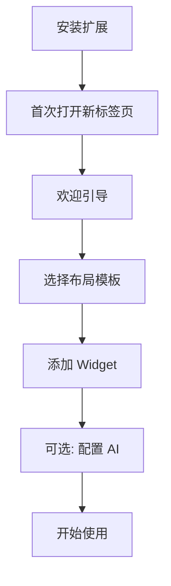
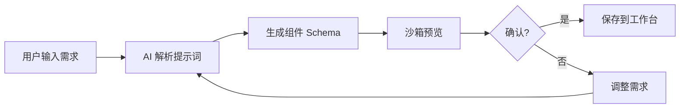
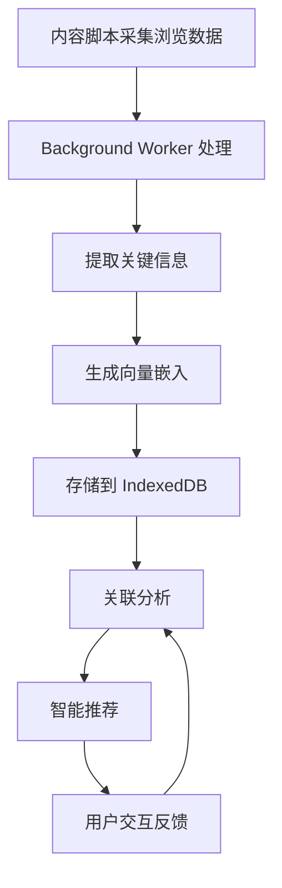
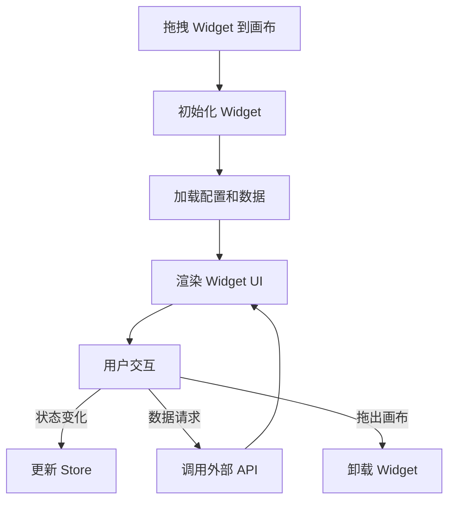

# MindTab 产品需求文档 (PRD)

## 1. 产品概述

MindTab 是一个 **AI 原生浏览器新标签页工作台**，旨在将浏览器从"页面容器"升级为智能工作空间。

### 核心定位

MindTab 不是传统的浏览器 Dashboard，而是一个：

- **工作记忆中枢**：跨标签页上下文理解与记忆
- **AI 上下文操作系统**：AI 驱动的工作流编排
- **知识生命周期管理器**：从信息到知识的转化与沉淀
- **零配置自适应工作台**：开箱即用的智能体验

### 目标用户

- 需要高效管理多任务的研究人员与知识工作者
- 追求 AI 原生工具体验的技术爱好者
- 需要跨标签页工作记忆的开发者与分析师
- 重视隐私的本地优先用户

### 核心价值主张

1. **跨标签页工作记忆**：浏览器首次"理解"你的工作上下文
2. **AI 原生驱动布局**：智能推荐与自适应工作流
3. **AI 随心搭**：自然语言生成专属组件
4. **本地优先隐私架构**：数据完全可控

---

## 2. 核心功能

### 2.1 用户角色

| 角色 | 权限范围 | 核心能力 |
|------|----------|----------|
| 普通用户 | 本地使用 | 所有基础功能、AI 组件生成、本地记忆 |
| 注册用户 | 云端同步 | 跨设备同步、团队协作、组件市场 |

### 2.2 功能模块

#### 2.2.1 新标签页工作台

- **三栏自适应布局**：左侧导航栏、中央主工作区、右侧面板
- **可定制 Widget 系统**：拖拽布局、动态调整大小
- **快速访问区**：收藏网站、最近标签页、常用工具
- **AI 推荐面板**：基于上下文的智能建议

#### 2.2.2 官方 Widget 组件

第一批核心组件：

| Widget | 功能描述 | 数据来源 |
|--------|----------|----------|
| 时钟 | 实时时间、日期、世界时间 | 本地时间 API |
| 天气 | 当前天气、预报、位置 | Weather API |
| 搜索 | 多引擎搜索、AI 搜索增强 | Bing/Google API |
| Todo | 任务管理、清单列表 | 本地存储 |
| Quick Note | 快速笔记、剪贴板内容 | 本地存储 |
| 书签 | 浏览器书签快速访问 | Chrome API |

#### 2.2.3 AI 工坊 (AI Workshop)

- **自然语言组件生成**：用户描述需求，AI 生成可执行组件
- **组件预览沙箱**：安全隔离环境预览 AI 生成组件
- **组件市场**：用户创建的组件可分享到市场
- **版本管理**：组件历史版本追踪

#### 2.2.4 跨标签页记忆系统

- **浏览行为采集**：URL、标题、停留时长、切换频率、会话链
- **内容理解**：提取 meta、摘要、关键词、向量嵌入
- **关联分析**：会话图谱、语义图谱、浏览聚类
- **智能推荐**：相关标签页、历史研究、继续上次工作

#### 2.2.5 知识生命周期管理

- **信息捕获**：从浏览内容自动提取关键信息
- **知识沉淀**：结构化存储、标签分类、智能关联
- **知识检索**：基于语义的快速检索
- **知识应用**：跨会话上下文复用

### 2.3 页面详情

| 页面名称 | 模块名称 | 功能描述 |
|----------|----------|----------|
| 新标签页 | 顶部导航栏 | 用户头像、搜索入口、AI 助手按钮、设置入口 |
| 新标签页 | 左侧边栏 | Widget 抽屉、组件市场入口、记忆面板、设置 |
| 新标签页 | 中央工作区 | 可定制 Widget 网格布局、拖拽调整 |
| 新标签页 | 右侧面板 | AI 推荐、跨标签页记忆、快捷操作 |
| AI 工坊 | 提示词输入 | 自然语言描述组件需求 |
| AI 工坊 | 组件预览 | 沙箱环境实时预览生成组件 |
| AI 工坊 | 组件编辑器 | 代码编辑、配置调整、发布管理 |
| 设置页 | 布局设置 | 布局模板、间距调整、主题选择 |
| 设置页 | 组件管理 | 已安装组件、组件排序、权限管理 |
| 设置页 | AI 设置 | API 配置、模型选择、上下文长度 |
| 设置页 | 隐私设置 | 数据存储策略、记忆清理、云同步 |

---

## 3. 核心流程

### 3.1 用户首次使用流程



### 3.2 AI 组件生成流程



### 3.3 跨标签页记忆流程



### 3.4 Widget 生命周期



---

## 4. 用户界面设计

### 4.1 设计风格

#### 设计理念

灵感来源：Claude 风格系统

- **温暖奶油画布**：#faf9f5 淡奶油色基调
- **珊瑚主色调**：#cc785c 品牌珊瑚色
- **编辑社论风**：衬线标题 + 无衬线正文
- **低调阴影哲学**：色彩区分层次，阴影仅用于悬停状态
- **产品化深色面板**：深色表面用于产品功能展示

#### 色彩系统

**品牌与强调色**

| Token | 色值 | 用途 |
|-------|------|------|
| `colors.primary` | #cc785c | 主 CTA、品牌强调 |
| `colors.primary-active` | #a9583e | 按钮悬停/按下态 |
| `colors.primary-disabled` | #e6dfd8 | 禁用态 |
| `colors.accent-teal` | #5db8a6 | 次要强调（状态指示） |
| `colors.accent-amber` | #e8a55a | 分类标签 |

**表面色**

| Token | 色值 | 用途 |
|-------|------|------|
| `colors.canvas` | #faf9f5 | 页面背景（默认） |
| `colors.surface-soft` | #f5f0e8 | 区域分割 |
| `colors.surface-card` | #efe9de | 卡片背景 |
| `colors.surface-dark` | #181715 | 深色面板（代码、产品展示） |
| `colors.hairline` | #e6dfd8 | 边框线 |

**文本色**

| Token | 色值 | 用途 |
|-------|------|------|
| `colors.ink` | #141413 | 标题、主要文字 |
| `colors.body` | #3d3d3a | 正文 |
| `colors.muted` | #6c6a64 | 次要文字、标签 |
| `colors.on-primary` | #ffffff | 主按钮文字 |
| `colors.on-dark` | #faf9f5 | 深色表面文字 |

#### 字体系统

**显示字体**（标题）
- 主选：Cormorant Garamond (weight 400)
- 备选：EB Garamond, Georgia, serif
- 负字间距 (-0.02em)

**正文字体**
- 主选：Inter (weight 400/500)
- 备选：-apple-system, BlinkMacSystemFont, sans-serif

**等宽字体**
- JetBrains Mono (代码块)

| Token | Size | Weight | Line Height | Letter Spacing | 用途 |
|-------|------|--------|-------------|----------------|------|
| `typography.display-xl` | 64px | 400 | 1.05 | -1.5px | 首页 H1 |
| `typography.display-lg` | 48px | 400 | 1.1 | -1px | 章节标题 |
| `typography.display-md` | 36px | 400 | 1.15 | -0.5px | 子章节标题 |
| `typography.title-lg` | 22px | 500 | 1.3 | 0 | 功能卡片标题 |
| `typography.body-md` | 16px | 400 | 1.55 | 0 | 正文 |
| `typography.body-sm` | 14px | 400 | 1.55 | 0 | 页脚、说明文字 |
| `typography.caption` | 13px | 500 | 1.4 | 0 | 标签文字 |

#### 间距系统

基础单位：4px

| Token | 值 | 用途 |
|-------|------|------|
| `spacing.xxs` | 4px | 微间距 |
| `spacing.xs` | 8px | 小间距 |
| `spacing.sm` | 12px | 组件内小间距 |
| `spacing.md` | 16px | 默认间距 |
| `spacing.lg` | 24px | 卡片内间距 |
| `spacing.xl` | 32px | 大卡片内间距 |
| `spacing.xxl` | 48px | CTA 内间距 |
| `spacing.section` | 96px | 区块间距 |

#### 圆角系统

| Token | 值 | 用途 |
|-------|------|------|
| `rounded.xs` | 4px | 微圆角 |
| `rounded.sm` | 6px | 小按钮 |
| `rounded.md` | 8px | 标准按钮、输入框 |
| `rounded.lg` | 12px | 内容卡片 |
| `rounded.xl` | 16px | 大容器 |
| `rounded.pill` | 9999px | 标签 |

### 4.2 组件设计

#### 按钮组件

| 组件 | 样式描述 |
|------|----------|
| `button-primary` | 珊瑚背景 #cc785c，白色文字，圆角 8px |
| `button-secondary` | 透明背景，hairline 边框，文字 #141413 |
| `button-ghost` | 无背景无边框，hover 显示背景 |
| `button-icon` | 36px 圆形图标按钮 |

#### 卡片组件

| 组件 | 样式描述 |
|------|----------|
| `widget-card` | surface-card 背景，圆角 12px，轻微阴影 hover |
| `feature-card` | surface-card 背景，圆角 12px，32px 内边距 |
| `dark-card` | surface-dark 背景，圆角 12px，用于代码/产品展示 |

#### 输入组件

| 组件 | 样式描述 |
|------|----------|
| `text-input` | canvas 背景，hairline 边框，8px 圆角，40px 高度 |
| `search-input` | 左侧搜索图标，圆角 9999px pill 形状 |
| `textarea` | 多行文本输入，min-height 100px |

### 4.3 布局系统

**新标签页三栏布局**

```
┌─────────────────────────────────────────────────────┐
│                    顶部导航栏                        │
├────────┬──────────────────────────────┬─────────────┤
│        │                              │             │
│ 左侧   │        中央工作区              │   右侧      │
│ 边栏   │     (Widget 画布)             │   面板      │
│        │                              │             │
│ 80px   │        flex-1                 │   320px     │
│        │                              │             │
└────────┴──────────────────────────────┴─────────────┘
```

**响应式断点**

| 名称 | 宽度 | 布局变化 |
|------|------|----------|
| Desktop | >= 1280px | 完整三栏布局 |
| Tablet | 768px - 1279px | 左侧边栏收起，中央 + 右侧面板 |
| Mobile | < 768px | 单栏布局，底部导航 |

### 4.4 交互设计

#### 动效原则

- **页面加载**：组件依次淡入，延迟 50ms 交错
- **悬停反馈**：transform scale(1.02)，150ms ease-out
- **拖拽**：实时跟随鼠标，阴影增强
- **展开/收起**：高度过渡 300ms ease-in-out

#### 状态反馈

- **加载中**：骨架屏占位 + 脉冲动画
- **空状态**：插图 + 引导文案
- **错误状态**：红色边框 + 错误提示文字

---

## 5. 技术约束

### 5.1 浏览器兼容性

- Chrome 88+ (Manifest V3 支持)
- 目标：Edge、Arc、Brave 等 Chromium 内核浏览器

### 5.2 性能目标

- 新标签页打开 < 200ms
- Widget 交互响应 < 50ms
- 内存占用 < 100MB（无 AI 操作时）

### 5.3 安全约束

- 所有 AI 生成组件必须在沙箱 iframe 中执行
- CSP 策略限制外部脚本
- 用户数据本地优先，云同步可选且加密

---

## 6. 发布阶段

### Phase 1 - MVP（当前开发目标）

核心功能：

- 新标签页基础界面
- 官方 Widget 组件（时钟、天气、搜索、Todo、Quick Note）
- Widget 拖拽布局系统
- 本地存储持久化
- AI Chat 功能（基础）

### Phase 2 - AI 工坊

- 自然语言组件生成
- 沙箱预览系统
- 组件市场基础

### Phase 3 - 跨标签页记忆

- 浏览行为采集
- 会话关联分析
- 智能推荐系统

### Phase 4 - 云同步与生态

- 跨设备同步
- 团队协作
- 插件 SDK
