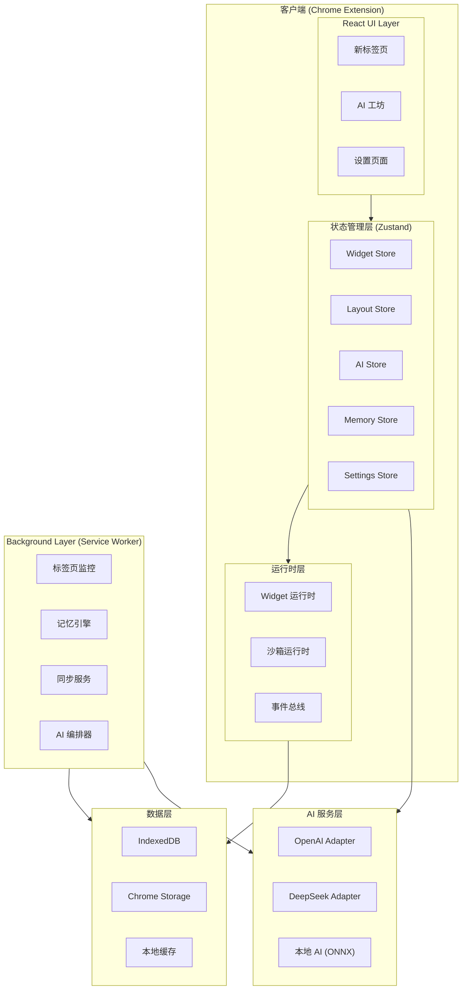
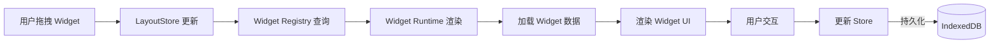
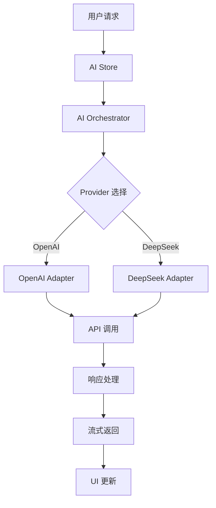
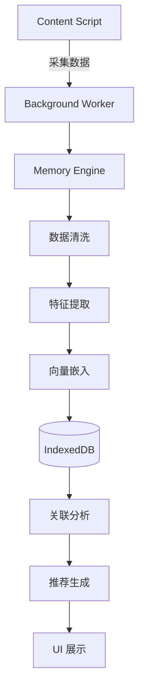
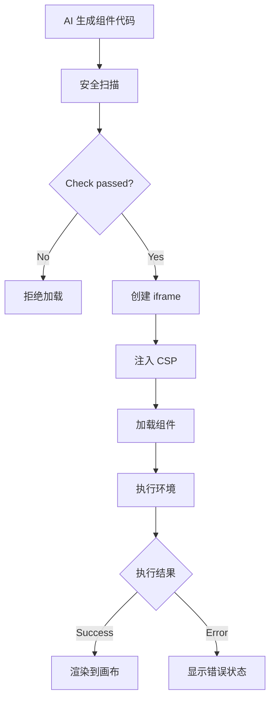
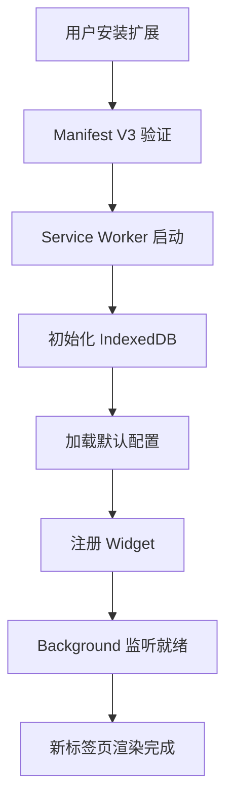

# MindTab 技术架构文档

## 1. 架构设计概览

### 1.1 整体架构图



### 1.2 Monorepo 结构

```
mindtab/
├── apps/
│   ├── extension/              # Chrome 扩展主应用
│   │   ├── src/
│   │   │   ├── background/     # Background Service Worker
│   │   │   ├── content/        # Content Scripts
│   │   │   ├── popup/          # Popup 弹窗
│   │   │   ├── newtab/         # 新标签页
│   │   │   └── options/        # 选项页面
│   │   ├── public/
│   │   └── manifest.json
│   │
│   └── dashboard/             # 独立 Dashboard (开发用)
│       └── src/
│
├── packages/
│   ├── ui/                    # 共享 UI 组件库
│   │   └── src/
│   │       ├── components/     # 基础组件
│   │       ├── styles/         # 样式和主题
│   │       └── index.ts
│   │
│   ├── widgets/               # 官方 Widget 组件
│   │   └── src/
│   │       ├── clock/
│   │       ├── weather/
│   │       ├── search/
│   │       ├── todo/
│   │       ├── quick-note/
│   │       └── bookmarks/
│   │
│   ├── widget-runtime/         # Widget 运行时
│   │   └── src/
│   │       ├── registry/       # 组件注册表
│   │       ├── renderer/       # 渲染器
│   │       └── sandbox/        # 沙箱管理
│   │
│   ├── ai-core/                # AI 核心层
│   │   └── src/
│   │       ├── providers/     # AI 提供商适配器
│   │       ├── pipeline/       # 处理管道
│   │       └── orchestrator/   # 编排器
│   │
│   ├── storage/                # 存储抽象层
│   │   └── src/
│   │       ├── repositories/  # 数据仓库
│   │       ├── indexeddb/      # IndexedDB 实现
│   │       └── chrome-storage/ # Chrome Storage 实现
│   │
│   ├── memory-engine/          # 记忆引擎
│   │   └── src/
│   │       ├── collector/      # 数据采集
│   │       ├── analyzer/       # 分析器
│   │       └── graph/          # 知识图谱
│   │
│   ├── layout-engine/          # 布局引擎
│   │   └── src/
│   │       ├── grid/          # 网格系统
│   │       └── responsive/    # 响应式
│   │
│   ├── shared/                 # 共享工具
│   │   └── src/
│   │       ├── types/         # 类型定义
│   │       ├── utils/         # 工具函数
│   │       ├── constants/     # 常量
│   │       └── hooks/         # 共享 Hooks
│   │
│   └── event-bus/             # 事件总线
│       └── src/
│
├── services/
│   └── embedding/             # 向量嵌入服务
│
├── infra/
│   ├── scripts/               # 构建脚本
│   ├── configs/               # 配置文件
│   └── tools/                # 开发工具
│
├── package.json
├── pnpm-workspace.yaml
├── turbo.json
└── tsconfig.json
```

---

## 2. 技术选型

### 2.1 技术栈

| 层级 | 技术 | 版本 | 用途 |
|------|------|------|------|
| 框架 | React | 18.x | UI 框架 |
| 语言 | TypeScript | 5.x | 类型安全 |
| 状态管理 | Zustand | 4.x | 全局状态 |
| 样式 | TailwindCSS | 3.x | 原子化 CSS |
| 动画 | Framer Motion | 10.x | 交互动画 |
| 数据校验 | Zod | 3.x | Schema 验证 |
| 存储 | Dexie.js | 3.x | IndexedDB ORM |
| 构建 | Vite | 5.x | 快速构建 |
| 包管理 | pnpm | 8.x | 依赖管理 |
| 任务管理 | Turborepo | 1.x | Monorepo 构建 |

### 2.2 Chrome Extension 特定

| 组件 | 技术 | 用途 |
|------|------|------|
| Manifest | V3 | 扩展清单版本 |
| Background | Service Worker | 后台脚本 |
| Content Script | TypeScript | 页面注入 |
| Storage | chrome.storage | 扩展存储 |
| Messaging | chrome.runtime | 通信 |

---

## 3. 模块边界与数据流

### 3.1 Widget 系统数据流



### 3.2 AI 服务数据流



### 3.3 记忆系统数据流



---

## 4. 状态管理策略

### 4.1 Zustand Store 划分

```typescript
// 1. Widget Store - Widget 配置和状态
interface WidgetStore {
  widgets: Widget[];
  addWidget: (widget: Widget) => void;
  removeWidget: (id: string) => void;
  updateWidget: (id: string, updates: Partial<Widget>) => void;
  reorderWidgets: (fromIndex: number, toIndex: number) => void;
}

// 2. Layout Store - 布局配置
interface LayoutStore {
  layout: Layout;
  updateLayout: (layout: Partial<Layout>) => void;
  resetLayout: () => void;
}

// 3. AI Store - AI 相关状态
interface AIStore {
  messages: Message[];
  isProcessing: boolean;
  sendMessage: (message: string) => Promise<void>;
  clearHistory: () => void;
}

// 4. Memory Store - 记忆系统状态
interface MemoryStore {
  sessions: Session[];
  currentSession: Session | null;
  recommendations: Recommendation[];
  addSession: (session: Session) => void;
}

// 5. Settings Store - 用户设置
interface SettingsStore {
  settings: Settings;
  updateSettings: (settings: Partial<Settings>) => void;
  resetSettings: () => void;
}
```

### 4.2 Store 持久化策略

```typescript
// 使用 Zustand persist 中间件
const useWidgetStore = create<WidgetStore>()(
  persist(
    (set, get) => ({
      // ... store implementation
    }),
    {
      name: 'mindtab-widgets',
      storage: createJSONStorage(() => chrome.storage.local),
    }
  )
);
```

---

## 5. Widget 渲染管道

### 5.1 Widget 注册表

```typescript
interface WidgetManifest {
  id: string;
  name: string;
  version: string;
  description: string;
  icon: string;
  defaultSize: { width: number; height: number };
  minSize: { width: number; height: number };
  maxSize: { width: number; height: number };
  permissions?: string[];
}

interface WidgetInstance {
  id: string;
  manifestId: string;
  position: { x: number; y: number };
  size: { width: number; height: number };
  config: Record<string, unknown>;
  isActive: boolean;
}
```

### 5.2 Widget 生命周期

```
onMount → onInit → onRender → onUpdate → onDestroy
          ↓
      onError (错误边界)
```

### 5.3 SandBox 执行架构



---

## 6. AI 服务抽象

### 6.1 Provider 接口

```typescript
interface AIProvider {
  name: string;
  stream(prompt: string, options?: StreamOptions): AsyncGenerator<string>;
  chat(messages: Message[], options?: ChatOptions): Promise<AIResponse>;
  countTokens(text: string): number;
}

interface AIResponse {
  content: string;
  usage: {
    promptTokens: number;
    completionTokens: number;
    totalTokens: number;
  };
  finishReason: 'stop' | 'length' | 'content_filter' | 'error';
}
```

### 6.2 支持的 Provider

| Provider | 模型 | 特点 |
|----------|------|------|
| OpenAI | GPT-4 / GPT-3.5 | 通用能力强 |
| DeepSeek | DeepSeek Chat | 性价比高 |
| Local | ONNX Runtime | 完全本地 |

---

## 7. 存储抽象层

### 7.1 Repository 模式

```typescript
// 基础 Repository 接口
interface Repository<T> {
  get(id: string): Promise<T | null>;
  getAll(): Promise<T[]>;
  save(entity: T): Promise<void>;
  delete(id: string): Promise<void>;
  query(query: Query): Promise<T[]>;
}

// 具体实现
class WidgetRepository implements Repository<Widget> {
  constructor(private db: Dexie) {}

  async get(id: string): Promise<Widget | null> {
    return this.db.widgets.get(id);
  }

  async save(widget: Widget): Promise<void> {
    await this.db.widgets.put(widget);
  }

  // ...
}
```

### 7.2 IndexedDB Schema

```typescript
// 使用 Dexie.js 定义 Schema
const db = new Dexie('MindTabDB');

db.version(1).stores({
  widgets: '++id, manifestId, type, createdAt',
  sessions: '++id, url, title, startedAt, endedAt',
  memories: '++id, sessionId, type, createdAt',
  embeddings: 'id, sessionId, vector, createdAt',
  settings: 'key',
  cache: 'key, expiresAt',
});
```

---

## 8. 事件系统

### 8.1 Event Bus 设计

```typescript
// 事件类型定义
type EventType =
  | 'widget:added'
  | 'widget:removed'
  | 'widget:updated'
  | 'layout:changed'
  | 'ai:message:received'
  | 'memory:updated'
  | 'tab:activated'
  | 'sync:complete';

// 事件总线
class EventBus {
  private listeners: Map<EventType, Set<EventHandler>> = new Map();

  subscribe(event: EventType, handler: EventHandler): () => void;
  publish(event: EventType, data: unknown): void;
  unsubscribe(event: EventType, handler: EventHandler): void;
}
```

### 8.2 Chrome 消息通信

```typescript
// Content Script <-> Background
chrome.runtime.sendMessage(
  { type: 'GET_TAB_INFO', tabId: tab.id },
  (response) => {
    // 处理响应
  }
);

// 新标签页 <-> Background
chrome.runtime.sendMessage(
  { type: 'GET_MEMORY_SUMMARY' },
  (response) => {
    // 处理响应
  }
);
```

---

## 9. 安全模型

### 9.1 CSP 策略

```json
{
  "content_security_policy": {
    "extension_pages": "script-src 'self'; object-src 'self'",
    "sandbox": "script-src 'self' 'unsafe-inline'; object-src 'none'"
  }
}
```

### 9.2 沙箱权限

| 权限 | 说明 |
|------|------|
| `widget:network` | 允许网络请求 |
| `widget:storage` | 允许本地存储 |
| `widget:ai` | 允许 AI 调用 |

### 9.3 数据隐私

- 所有用户数据默认本地存储
- 云同步使用端到端加密
- 记忆数据可配置自动清理

---

## 10. 性能优化策略

### 10.1 加载优化

- **Code Splitting**: Widget 按需加载
- **Tree Shaking**: 移除未使用代码
- **Lazy Render**: 非视口 Widget 延迟渲染
- **Service Worker**: 缓存静态资源

### 10.2 运行时优化

- **Virtual List**: 长列表虚拟化
- **Debounce**: 频繁操作防抖
- **Memo**: 组件缓存
- **Web Worker**: 密集计算移至 Worker

### 10.3 内存优化

- **WeakMap/WeakRef**: 弱引用缓存
- **Cleanup**: 组件卸载清理
- **Pooling**: 对象池复用

---

## 11. 扩展生命周期

### 11.1 安装流程



### 11.2 Service Worker 生命周期

- **安装**: 初始化、缓存资源
- **激活**: 清理旧缓存
- **运行时**: 响应消息、处理事件
- **休眠**: 无活动后休眠，节省资源

---

## 12. API 定义

### 12.1 Widget Runtime API

```typescript
// Widget Runtime 暴露给 Widget 的 API
interface WidgetAPI {
  getConfig<T>(): T;
  setConfig<T>(config: Partial<T>): void;
  getState<T>(): T;
  setState<T>(state: Partial<T>): void;
  onConfigChange(callback: (config: unknown) => void): void;
  onStateChange(callback: (state: unknown) => void): void;
  emit(event: string, data: unknown): void;
  on(event: string, callback: (data: unknown) => void): void;
  fetch(url: string, options?: RequestInit): Promise<Response>;
  storage: {
    get<T>(key: string): Promise<T>;
    set<T>(key: string, value: T): Promise<void>;
    remove(key: string): Promise<void>;
  };
}
```

### 12.2 Background API

```typescript
// Background 暴露给 UI 的 API
interface BackgroundAPI {
  getTabs(): Promise<Tab[]>;
  getActiveTab(): Promise<Tab>;
  getHistory(days: number): Promise<HistoryItem[]>;
  getBookmarks(): Promise<Bookmark[]>;
  getMemorySummary(): Promise<MemorySummary>;
  saveWidgetConfig(config: WidgetConfig): Promise<void>;
  syncData(): Promise<void>;
}
```

---

## 13. 类型定义

### 13.1 核心类型

```typescript
// Widget 类型
interface Widget {
  id: string;
  manifestId: string;
  type: WidgetType;
  title: string;
  config: Record<string, unknown>;
  position: Position;
  size: Size;
  isActive: boolean;
  createdAt: number;
  updatedAt: number;
}

type WidgetType =
  | 'clock'
  | 'weather'
  | 'search'
  | 'todo'
  | 'quick-note'
  | 'bookmarks'
  | 'ai-chat'
  | 'custom';

// 位置和尺寸
interface Position {
  x: number;
  y: number;
  row?: number;
  col?: number;
}

interface Size {
  width: number;
  height: number;
  minWidth?: number;
  minHeight?: number;
  maxWidth?: number;
  maxHeight?: number;
}

// 布局类型
interface Layout {
  id: string;
  name: string;
  type: 'grid' | 'free' | 'masonry';
  columns: number;
  rows: number;
  gap: number;
  widgets: WidgetPlacement[];
}

interface WidgetPlacement {
  widgetId: string;
  position: Position;
  size: Size;
}
```

---

## 14. 未来扩展性

### 14.1 插件市场兼容性

- Widget Manifest 标准格式
- 沙箱执行环境隔离
- 权限申请模型
- 组件版本管理

### 14.2 SDK 设计

```typescript
// 第三方 Widget 开发 SDK
import { createWidget } from '@mindtab/widget-sdk';

createWidget({
  id: 'my-widget',
  name: 'My Widget',
  version: '1.0.0',
  component: MyWidgetComponent,
  permissions: ['storage'],
});
```

### 14.3 云同步架构

```
┌─────────┐     ┌─────────┐     ┌─────────┐
│  Client │────▶│  Sync   │────▶│  Cloud  │
│         │◀────│  Engine │◀────│  Server │
└─────────┘     └─────────┘     └─────────┘
     │               │               │
     ▼               ▼               ▼
 IndexedDB      Conflict        Encrypted
                 Resolution      Storage
```

---

## 15. 开发工作流

### 15.1 本地开发

```bash
# 安装依赖
pnpm install

# 开发扩展
pnpm dev:extension

# 开发 Dashboard
pnpm dev:dashboard

# 类型检查
pnpm typecheck

# 代码检查
pnpm lint

# 构建
pnpm build
```

### 15.2 测试策略

- **单元测试**: Vitest
- **集成测试**: Playwright
- **E2E 测试**: 自动化扩展测试

### 15.3 发布流程

1. 构建生产版本
2. 打包 ZIP
3. Chrome Web Store 提交
4. 审核发布
